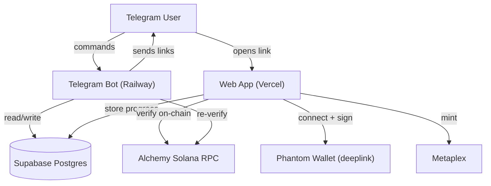

# GleanAI

> Open-source Telegram bot that onboards new users to Solana through fun quests and mini-games.

GleanAI guides newcomers through real Solana on-chain actions (create a wallet, get
SOL, swap tokens, stake, mint an NFT) framed as fun quests. Users earn points, climb
a leaderboard, and earn SOL rewards. A companion web app handles wallet connection,
quest verification, and a reaction-time mini-game called **Solana Sprint**.

This repo is built **incrementally** — each layer is shipped and tested before the
next one starts.

## Monorepo layout

```
gleanai/
├── bot/        # Telegram bot (Node.js + Telegraf) -> deploys to Railway
├── web/        # Web app (Next.js + Tailwind) -> deploys to Vercel
├── supabase/   # Database migrations + seed
├── .env.example
└── package.json (npm workspaces)
```

## Tech stack

| Concern              | Choice                          |
| -------------------- | ------------------------------- |
| Telegram bot         | Node.js + Telegraf              |
| Web app              | Next.js + Tailwind CSS          |
| Database             | Supabase (Postgres)             |
| On-chain verify      | Alchemy Solana RPC (polling v1) |
| Wallet connect       | Phantom deeplinks               |
| NFT minting          | Metaplex                        |
| Hosting              | Vercel (web) + Railway (bot)    |

## Architecture



## Build status (incremental)

- [x] **1. Foundation** — monorepo skeleton + Supabase schema migration + quest seed
- [x] **2. Bot commands** (`/start`, `/quests`, `/points`, `/leaderboard`, `/referral`)
- [x] **3. Web wallet connect** (Phantom deeplink) - Arcade Speedrun Terminal UI
- [x] **4. Quest verification** (Alchemy Solana RPC)
- [x] **5. Solana Sprint mini-game** (timed speedrun + shareable result card)
- [x] **6. Admin dashboard** (password-gated `/admin` for manual reward payouts)
- [x] **7. Telegram Mini App** (`/app` in-Telegram experience, secure `initData` auth, launch button)
- [x] **8. Leveling system** (points-based levels + titles, shown in Mini App and `/points`)

## Getting started

### Prerequisites
- Node.js >= 20
- A Supabase project ([supabase.com](https://supabase.com))
- An Alchemy API key ([dashboard.alchemy.com](https://dashboard.alchemy.com)) - create a Solana app
- A Telegram bot token (via [@BotFather](https://t.me/BotFather))

### Setup
1. Clone the repo and install dependencies:
   ```bash
   npm install
   ```
2. Copy `.env.example` and fill in the values for each service (see file comments).
3. Apply the database schema (see [Database](#database) below).

## Database

The schema lives in [`supabase/migrations/0001_init.sql`](supabase/migrations/0001_init.sql)
and the 10 starter quests are in [`supabase/seed.sql`](supabase/seed.sql).

Apply it with the Supabase CLI:

```bash
supabase db push          # apply migrations to the linked project
psql "$DATABASE_URL" -f supabase/seed.sql   # load the 10 quests
```

…or paste the SQL files into the Supabase Studio SQL editor (migration first, then seed).

### Tables

| Table               | Purpose                                                   |
| ------------------- | --------------------------------------------------------- |
| `users`             | Telegram identity + linked wallet + points + referral code|
| `quests`            | Catalog of the 10 quests and their verification type      |
| `quest_completions` | One row per user+quest with on-chain proof (tx signature) |
| `referrals`         | Referrer → referred audit + bonus points                  |
| `points_ledger`     | Auditable record of every point movement                  |
| `sprint_runs`       | Solana Sprint results (time, actions, result card URL)    |
| `rewards`           | Manual SOL payout tracking for the admin dashboard        |
| `admins`            | Telegram IDs allowed to use the admin dashboard           |

> Row Level Security is enabled on every table. Only the `quests` catalog is publicly
> readable; all other access goes through the **service-role key, server-side only**
> (Telegram is the identity, not Supabase Auth).

## Design constraints (v1)

- **No gambling mechanics.** Every game is skill-based, educational, or reaction-time.
- **No smart contract.** All rewards are tracked in Supabase and paid manually by an admin.
- **Phantom via deeplink**, opened in a normal browser from a bot link (Telegram's
  in-app webview cannot use extensions and is unreliable for deeplinks).

## License

[MIT](LICENSE)
